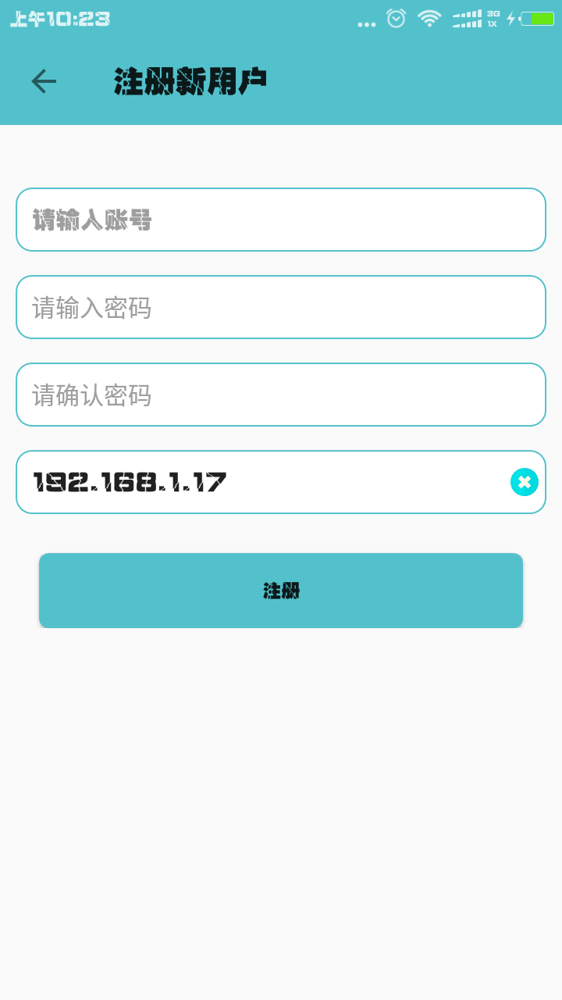
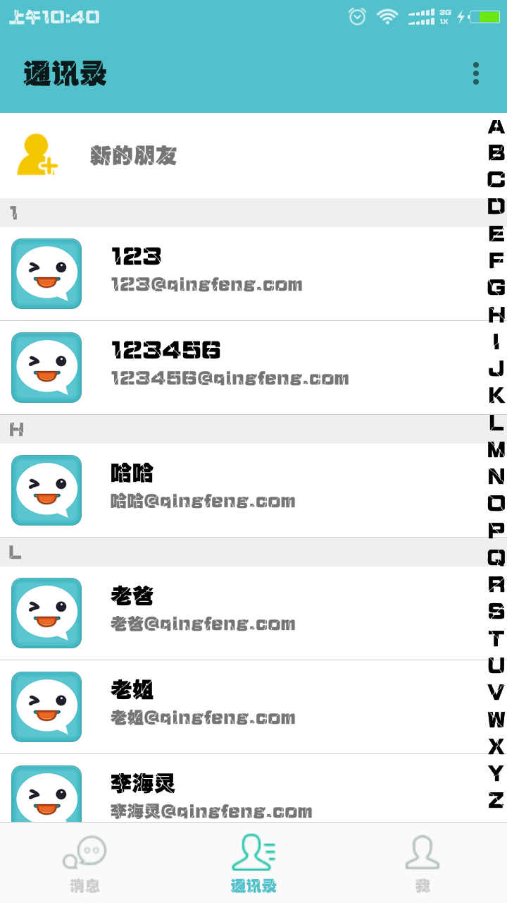
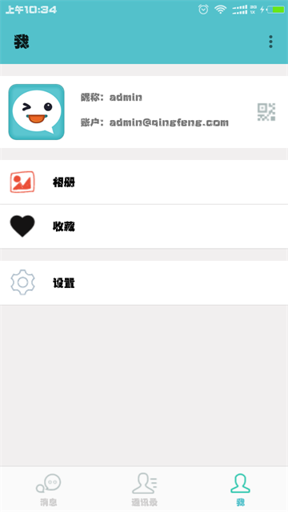
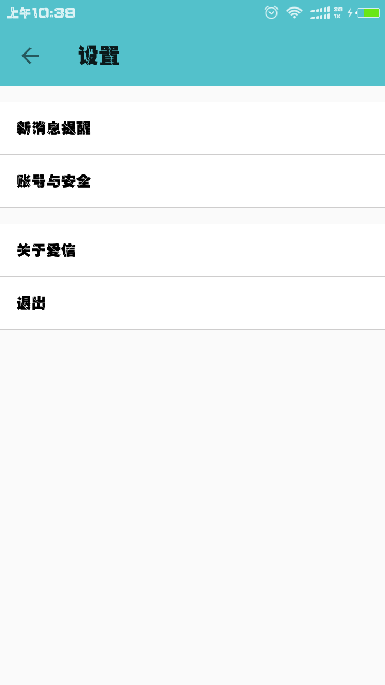
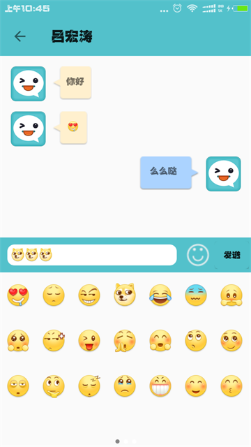

# Loveletter
一款基于XMPP协议的即时聊天软件，使用MVP模式作为该项目的基本架构 
### 一.项目模块：
  1. 登录模块
    * 闪屏页面
    * 引导页面    app引导界面
    * 登录页面    用户登录
  2. 主功能模块
    * 消息界面    显示本地缓存的消息记录
    * 联系人界面  登录用户的好友列表
    * 个人界面    显示个人的详细信息
  3. 其他模块
    * 聊天界面    对应的联系人进行聊天界面
    * 设置界面    消息提醒方式等的修改
    
### 二.app重点以及难点：
  1. 联系人的缓存,显示以及实时更新
  2. 接收发送消息的缓存,显示以及实时更新
  3. 聊天界面的友好显示
  4. fragment的懒加载
  
### 三.遇到的困难:
  1. 聊天发送表情
  2. 软键盘状态的监听
  3. 表情列表的实现以及表情列表与软键盘的切换
  4. 二维码扫描添加好友

### 四.app截图:

 * 注册界面：

      

 * 登录界面：

      

 *  消息界面:

      

 * 通讯录界面:

      

 * 个人界面:

    

 * 设置界面:

      

 * 聊天界面:

      

### 五.app的使用

    在您的电脑上安装openfire服务器 并在cn/qingfeng/aixin/service/Global.java修改本地ip便可以使用该app

